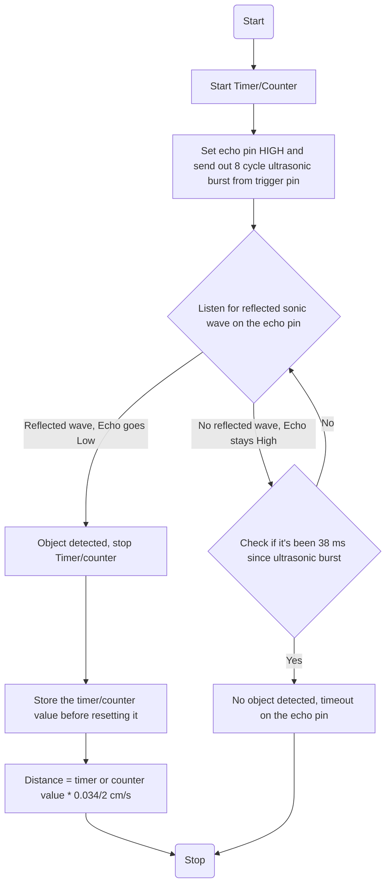

## ATMEGA HCSR04 Ultrasonic sensor driver

The HC-SR04 is an affordable and easy to use distance measuring sensor which has a range from 2cm to 400cm (about an inch to 13 feet).

The sensor is composed of two ultrasonic transducers. One is transmitter which outputs ultrasonic sound pulses and the other is receiver which listens for reflected waves. It’s basically a [SONAR](https://en.wikipedia.org/wiki/Sonar)

| Operating Voltage   | 5V DC           |
| ------------------- | --------------- |
| Operating Current   | 15mA            |
| Operating Frequency | 40KHz           |
| Min Range           | 2cm / 1 inch    |
| Max Range           | 400cm / 13 feet |
| Accuracy            | 3mm             |
| Measuring Angle     | <15°            |

The sensor has 4 pins: **VCC and GND** go to 5V and GND pins on the MCU, and the Trig and Echo go to any digital MCU pin. Using the Trig pin we send the ultrasound wave from the transmitter, and with the Echo pin we listen for the reflected signal.

It emits an ultrasound at 40 000 Hz which travels through the air and if there is an object or obstacle on its path It will bounce back to the module. Considering the travel time and the speed of the sound you can calculate the distance.

In order to generate the ultrasound we need to set the Trig pin on a High State for 10 µs. That will send out an 8 cycle ultrasonic burst which will travel at the [speed of sound](https://en.wikipedia.org/wiki/Speed_of_sound). The Echo pins goes high immediately after that 8 cycle ultrasonic burst is sent, and it starts listening or waiting for that wave to be reflected from an object.

If there is no object or reflected pulse, the Echo pin will time-out after 38ms and get back to low state. If, however, we receive a reflected pulse, the Echo pin will go down sooner than those 38ms. By knowing the exact duration of time for which the Echo pin was HIGH, we can determine the distance the sound wave travelled, thus the distance from the sensor to the object.

***Distance = Speed x Time/2***

We actually know both the speed and the time values. The time here is the amount of time the Echo pin was HIGH, and the speed is the speed of sound which is 340m/s. There’s one additional step we need to do, and that’s divide the end result by 2. and that’s because we are measuring the duration the sound wave needs to travel to the object and bounce back.

#### General code flow:

